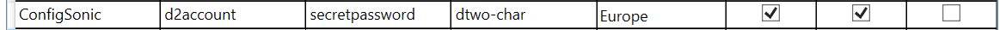
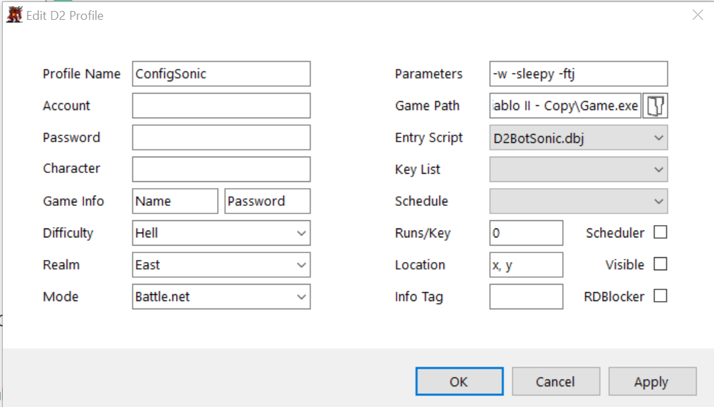
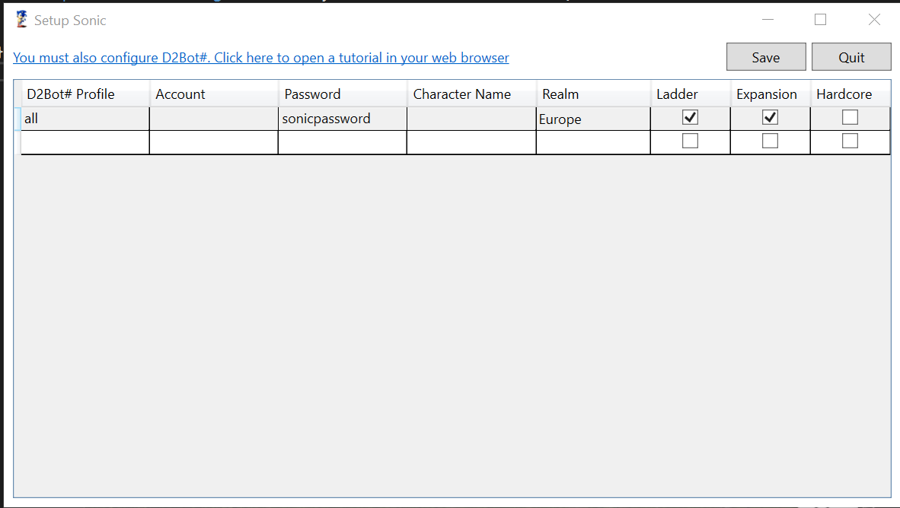

## Sonic Setup

----

**cloned from** https://github.com/SetupSonic/SetupSonic/wiki/D2Bot%23-Configuration

Many thanks to [Laz](https://github.com/laztheripper) - the author of sonic scripts.

----

* [Things to be aware of:](#things-to-be-aware-of)
* [Sonic configuration](#sonic-configuration)
* [D2Bot# Setup](#d2bot-setup)
* [Using the all default profile](#using-the-all-default-profile)

----

**Sonic is a solo sorceress script**. It starts from a completely fresh character and plays through the game.

It will allow you to get a level 1 - ~80 sorceress in around 15 hours.

If you have problems running the application, ensure you have at least [.NET 4.5 installed](https://www.microsoft.com/en-au/download/details.aspx?id=30653)

## Things to be aware of:

* Don't delete the all profile in Setup Sonic , this is used as the default profile configuration for profiles that don't have a specific sonic profile. If you accidentally delete it then be sure to re-add it.

* Your D2Bot# profile name must include the term sonic. It doesn't matter how, as long as it's in there somewhere. All of these names are valid: asonic, profile sonic, hi-Sonic.

* You should also setup mule profiles by following the normal steps from the kolbot guides.

## Sonic configuration

If you keep the Account or Character Name fields empty sonic will use a random string of characters for your Diablo II account and character name. This is why the all profile should keep these fields blank.

If you keep the Account or Character Name fields empty sonic will use a random string of characters for your Diablo II account and character name. This is why the all profile should keep these fields blank.

## D2Bot# Setup

Using the following Setup Sonic profile for this example:

There are only 3 D2Bot# settings you must change:

* Profile Name
* Game Path
* Entry Script

Sonic does not use any of the normal D2Bot# fields like Account, Password, Game Info, etc.

Here is my D2Bot# config, notice how the Profile Names match - ConfigSonic: 

Click start in D2Bot# and go to sleep/work and come back in 15 hours to a leveled sorceress.

## Using the all default profile

If you want to use the default sonic profile there is no need to create any other sonic profiles. 

With this configuration any D2Bot# sonic profiles (a "sonic profile" is simply one with sonic in the profile name) created will use this config. The characters created will be on Europe Ladder Expansion. The characters will be created with a random account name and character name. Details for these accounts will be stored in d2bot-with-kolbot-sonic/d2bs/kolbot/libs/sonic/data/[ProfileName].json if you want to find the account name so you can login to the account or something.

Enjoy
